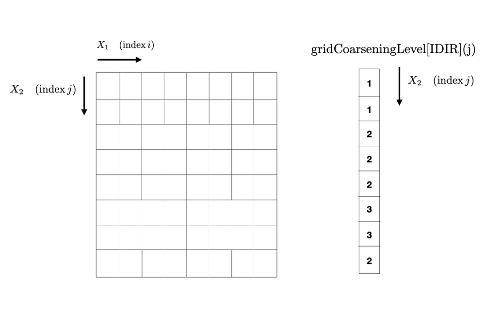

.. _gridCoarseningModule:

Grid coarsening module
==========================

About grid coarsening
---------------------

The grid coarsening module allows the user to derefine (=coarsen) the grid at specific locations.
In practice, the module averages adjacent cells to make one larger "effective" cell
(maintining :math:`\nabla\cdot B=0` in MHD). While this doesn't change
the amount of computations needed (as the underlying algorithm still compute the quantities on all of the cells),
it affects the CFL condition as the timestep is limited by

:math:`dt=\min\left[\min\left(\frac{2^{\ell-1}dx}{c}\right)+\min\left(\frac{2^{2\ell-2}dx^2}{\eta}\right)\right]`

where the first term comes from the hyperbolic condition while the second term comes from the parabolic condition,
and we have additionally introduced the coarsening level :math:`\ell`. Hence, grid coarsening essentially
allows one to speed up the computation by increasing the integration timestep. This is particularly useful
in non-uniform grids that become too fine in some regions (such as the polar region of spherical coordinates).

In *Idefix*, grid coarsening can be applied in any direction, however the coarsening level is not allowed to change along
the coarsening direction. For instance, if one wants grid coarsening the :math:`\phi` direction of spherical coordinates
to avoid too small cells around the polar axis, then the coarsening levels can be a function of :math:`r` and :math:`\theta`
only.

Using grid coarsening
---------------------

To use grid coarsening, one should explicitely say which direction(s) must be coarsened in the input file. This is done in the
[Grid] block, with the `coarsening`` entry described below

+----------------+-----------------------------+------------------------------------------------------------------------------------------+
|  Entry name    | Parameter type              | Comment                                                                                  |
+================+=============================+==========================================================================================+
| coarsening     | string, string, [string...] | | Enable grid coarsening. The first parameter should be either ``static`` or ``dynamic``,|
|                |                             | | which tells whether coarsening levels are computed once (``static``) or at each        |
|                |                             | | timestep (``dynamic``). The second (and third...) list the directions in which         |
|                |                             | | coarsening is applied. These can be ``X1``, ``X2`` and/or ``X3``.                      |
+----------------+-----------------------------+------------------------------------------------------------------------------------------+

When enabled, grid-coarsening expects a user-defined coarsening levels function to be enrolled calling ``DataBlock::EnrollGridCoarseningLevels()``
in your ``Setup`` constructor (see :ref:`functionEnrollment`). The user-defined coarsening levels function should take only a reference to
a ``DataBlock`` as parameter. It is expected to fill the vector of arrays ``DataBlock::CoarseningLevel`` with the coarsening level for each
direction in which coarsening is requested. The ``CoarseningLevel`` arrays are 2D arrays of integers, with a size that matches the sizes of the
current ``DatatBlock`` that are perpendicular to the coarsening direction. Hence, these arrays are at most 2 dimensional.

For instance, if coarsening is requested in ``X1``, then one needs to fill the array ``DataBlock::CoarseningLevel[IDIR]`` that will be indexed
with in the X2 (and X3 directions in 3D). The impact of the coarsening levels on the effective grid is shown in the example below.

.. tip::
  An example of grid coarsening in spherical coordinates is provided in the directory `test/MHD/AxisFluxTube`.

.. note::
  The minimum coarsening level is 1 (that is, the grid is left untouched).

.. warning::
  Grid coarsening requires the number of cells in the coarsening direction to be divisble by :math:`2^{\ell -1}`.
  When using MPI domain decomposition, this rule applies to the number of cells in each sub-domain.
