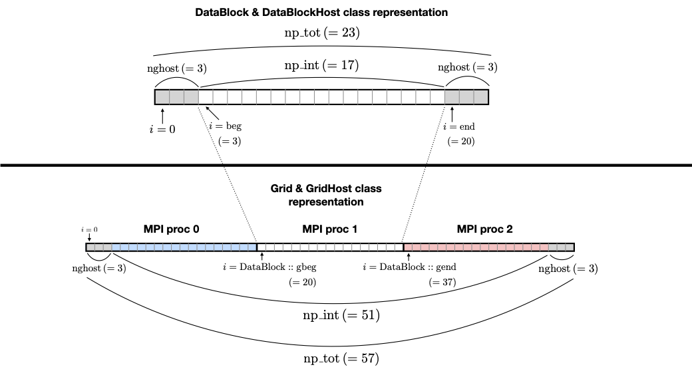

.. _programmingGuide:

======================
Programming guide
======================

Because *Idefix* is designed to run on hybrid architecture, there are some subtilities which
are not found in other classical CPU-only codes. These subtilities are described in this section, along
with some basic coding rules which can be handful.

Data types
===========

Because *Idefix* can run on GPUs, and since GPUs experience a significant speedup when working
with single precision arithmetic, a specific ``real`` datatype is used for all floating point
operations in *Idefix*. This is by default aliased to ``double`` in `idefix.hpp`, but it can easily converted
to ``single`` with cmake ``Idefix_PRECISION`` property. Single precision arithemtic can lead to very significant speedups
on some GPU architecture, but is not recommended for production runs as it can have an impact on the precision or even
convergence of the solution.

Host and device
===============

*Idefix* relies on the `Kokkos <https://kokkos.org/>`_ framework, and therefore assumes that system it's running is made
of two sub-systems: a host and a device. The host is traditionnaly the CPU, and is taking care
of inputs and outputs, initialisation and allocation, MPI data exchanges. The device is usually an
accelerator (e.g. a GPU) and is actually performing the computation (or most of it).

Note that while *Idefix* assumes there is a host and a device, they can be the same processing unit
(think of the code running only on your laptop CPU). In this case, Kokkos performs several optimisations,
so that everything effectively runs on the host smoothly.

By construction, the host doesn't have direct access to the device memory and vice-versa. This means
that accessing an array on the device from the host will inevitably lead to a segmentation fault.
This is a very common mistake, so keep this in mind when coding in *Idefix*.

Arrays
======
The fact that most of the computations are performed on the device implies that specific
allocations on the device need to be performed. To make things easier on the programmer's side, array allocations
should always use one of the ``IdefixArraynD`` where *n* is between 1 and 4. These arrays are
an alias for ``Kokkos::View`` which are fine-tuned for idefix, and are templated by the datatype,
which for most applications should be ``real``.

By definition, an ``IdefixArray`` is always allocated on the device, and is therefore not accessible
from the host. To define an array on the host, one use instead ``IdefixHostArraynD``.
Note that ``IdefixHostArraynD`` can be defined as mirrors of an ``IdefixArraynD``, to simplify data
transfer.

It should be noted that these
arrays are not just a contiguous memory zone as one would expect from a C array. Instead, they
are C++ objects, with several properties. In particular, pointer arithmetic, which is a common
(bad) practice on C arrays, is not allowed on ``IdefixArray``. Allocation is performed as an instantiation
of the ``IdefixArraynD`` class with the array name and size in parameter. For instance, the following code block will allocate
myOldArray and perform a shallow copy of ``myOldArray``.

.. code-block:: c++

  int arraySizeX1 = 10;  // 1st dimension of the arrays
  int arraySizeX2 = 10;  // 2nd dimension of the arrays
  // allocation
  IdefixArray2D<real> myOldrArray("ArrayName", arraySizeX1, arraySizeX2);
  // Shallow copy of myOldArray to myNewArray
  IdefixArray2D<real> myNewArray = myOldArray;

No data is copied,
``myNewArray`` is merely a new reference to the same memory block on the device. Similarly,
accessing an element of an ``IdefixArraynD`` should always be done with the accessor ``(...)``. In
the example above, one should use for instance ``myNewArray(1,2)`` (note the round brackets).

It is possible to copy data to/from the host/device manually using ``Kokkos::deep_copy`` (see examples
in ``DataBlockHost::syncToDevice()``). However, *Idefix* provides higher level functions
which should be sufficient for most uses through the classes ``DataBlockHost`` and ``GridHost``.

.. tip::
  ``IdefixArray`` internally contains a reference counter, so that when the array is not referenced
  anymore, the memory is automatically freed. Hence there is no equivalent of C ``free`` for
  ``IdefixArray``.

Execution space and loops
=========================
Just like with arrays, code can be executed on the host or on the device. Unless otherwise mentionned, code
is by default executed on the host. Since the device is supposed to be performing the computation itself
and because it is usually coded using loops, *Idefix* provides a special way to handle
loops which are to be executed on the device, with the function ``idefix_for``.

``idefix_for`` is just a way to write a for loop, with some caveats. Depending on the kind of device
*Idefix* is running, the loop can be unrolled in an arbitrary order, and some iterations might
be executed simultaneously. So care should be taken when writting loops.

A typical loop on three indices looks like

.. code-block:: c++

  // Allocate an Idefix Array
  IdefixArray3D<real> myArray("MyArray", nx1, nx2, nx3);

  idefix_for("LoopName",
             kbeg,kend,
             jbeg,jend,
             ibeg,ieng,
             KOKKOS_LAMBDA (int k, int j, int i) {
                myArray(k,j,i) = 0.0;
              });

This loop will be executed on the device, and will perform a loop on indices i,j,k ranging from
ibeg to iend for i, etc. Note that as expected, we access the data stored in an ``IdefixArray``
inside an ``idefix_for``, i.e. code which is executed on the device.

The string ``"LoopName"`` should be descriptive of the loop (i.e. avoid "loop1", "loop2"...).
It is used when profiling or debugging the code and it names the execution kernels.

Note finally that the last argument of ``idefix_for`` relies on the ``KOKKOS_LAMBDA`` construct,
which implies that *Idefix* is actually making a C++ lambda when a loop is called.
While this should be transparent to most users, It should be kept in mind that these lambdas
capture their variables by value [=]. To avoid too much overhead, one should therefore avoid capturing
complex structures. Moreover, a bug in the Nvidia Cuda compiler ``nvcc`` prevents Cuda lambdas
from capturing class members (`see  this post <https://github.com/kokkos/kokkos/issues/695>`_). While
this bug is tightly linked to the C++14 norm and will be addressed in C++17, one should always
make local copies of the class members before using them in loops, to keep compatibility with Cuda
in C++14.

.. warning::
  As stated above, to avoid compatibility issues with nvcc, *always* make local copies (references)
  of the arrays and variables you intend to use before calling ``idefix_loop``. This ensures that
  these variables will be properly captured by device lambdas. It is the most common reason for
  GPU specific segmentation faults.

.. warning::
  Generally, methods that contain calls to ``idefix_loop()`` should always be declared as
  ``public``. This is due to a limitation of the ``nvcc`` compiler which cannot perform
  lambda captures from private methods.

Reductions
==========

The ``idefix_for`` allows one to perform loops on arrays stored on the target. However, reductions
(that is, for instance, summing on all of the elements, or finding a maximum) are not possible
with ``idefix_for``. When a reduction is needed, one should instead use ``idefix_reduce``.

The syntax of ``idefix_reduce`` is very similar to that of ``idefix_for``, with the addition of the
variable over which the reduction is performed, and the type of reduction which is expected.
For instance, a sum over all of the elements would be done through:

.. code-block:: c++

  // Allocate an Idefix Array
  IdefixArray3D<real> myArray("MyArray", nx1, nx2, nx3);
  // Initialize the array somehow
  ...

  real mySum = 0.;   // Note that the result will be stored on the host!
  idefix_reduce("Sum",
                kbeg,kend,
                jbeg,jend,
                ibeg,ieng,
                KOKKOS_LAMBDA (int k, int j, int i, real &localSum) {
                    localSum += myArray(k,j,i);
                },
                Kokkos::Sum<real> (mySum));

In the above example, ``localSum`` is the temporary variable *on the device* over which portions of the reduction
are performed, while ``mySum`` is the final variable, *on the host* where the result is stored.

It is possible to do other reduction operations like findining minimum, maximum etc (see
`Kokkos custom reductions <https://kokkos.github.io/kokkos-core-wiki/API/core/builtin_reducers.html>`_
for a list). For instance, the minimum value is obtained with the following code
snippet:

.. code-block:: c++

  // Allocate an Idefix Array
  IdefixArray3D<real> myArray("MyArray", nx1, nx2, nx3);
  // Initialize the array somehow
  ...

  real myMin = 0.;   // Note that the result will be stored on the host!
  idefix_reduce("Minimum",
                kbeg,kend,
                jbeg,jend,
                ibeg,ieng,
                KOKKOS_LAMBDA (int k, int j, int i, real &localMin) {
                    localMin = std::fmin(localMin, myArray(k,j,i));
                },
                Kokkos::Min<real>(myMin));

Note that when running on GPU architectures, reductions are particularly inefficient operations. If possible,
it is therefore recommended to avoid them as much as possible, or to group them.

.. _grid:

Grid
========

Idefix uses a grid which is automatically built during startup using the informations provided in
the input file (see :ref:`gridSection`). While programming your own physical problem, it can be
useful to have access to the informations about the grid, such as the grid coordinates, cell volume,
etc. Because Idefix uses MPI domain decomposition, the grid is accessible in two classes. The *full* grid
(i.e the full physical problem, omitting any domain decomposition) is stored in the :ref:`gridClass`,
while the local MPI subdomain that belongs to each processor is stored in the :ref:`datablockClass` class.

The indices which are defined and used throughout the code in each of these classes are presented in the scheme below
(the numbers in parenthesis are the value of each variable in this particular example).

.. _classes:

Useful classes
==============

.. _inputClass:

The ``Input`` class
-------------------

``Input`` is a class which holds all of the information regarding command line and input file data.
It provides accessors such as

.. code-block:: c++

  // Accessor to input parameters
  // the arguments are always: BlockName, EntryName, ParameterNumber (starting from 0)

  // Read a parameter of type T from the input file and throw an error if it cannot be found
  // T can be a std::string, a number (real, int, double, float, int64_t) or a boolean
  template<typename T>
  T Get(std::string blockName, std::string paramName, int num);

  // Read a parameter of type T from the input file. Set it to default if it cannot be found.
  // T can be a std::string or a number (real, int, double, float, int64_t) or a boolean
  template<typename T>
  T GetOrSet(std::string blockName, std::string paramName, int num, T default);

  // Check that a block/entry is present
  int CheckEntry(std::string, std::string);

Note that ``Input`` doesn't really read the input file each time an accessor is called. Internally,
``Input`` reads everything when constructed in a C++ container with all the data coming from the command line and the input file.
Hence there is no read overhead when one calls one of these accessor.

For instance, considering a ``.ini`` file:

.. code-block::

  [MyBlock]
  myentry   1.0    0.0

It is possible to fetch the entry ``myentry`` using the ``Input`` accessors. Assuming an
instance of ``Input`` is allocated in ``myInput``:

.. code-block:: c++

  real firstParameter = myInput.Get<real>("MyBlock","myentry",0)  // firstParameter=1.0
  real secondParameter = myInput.Get<real>("MyBlock","myentry",1)  // secondParameter=0.0
  real thirdParameter = myInput.GetOrSet<real>("MyBlock","myentry",2, 0.0) // thirdParameter default to 0.0

If a parameter is not found, ``Get<T>`` will log an error and exit. One can use the ``CheckEntry``
method to check if a parameter is set in the ini file before trying to access it, or use ``GetOrSet<T>``
with a default value, as in the example above.

.. tip::
  Command line options are also parsed by the ``Input`` class. These options are stored in a
  specific block named ``CommandLine``.

.. _gridClass:

``Grid`` class
------------------

``Grid`` is essentially a datastructure which represents the full computational domain (i.e. without domain decomposition,
if MPI has been enabled). Here is the full API for this class (one may refer to :ref:`grid` for a graphical representation of the grid ):

.. doxygenclass:: Grid
  :members:

.. _datablockClass:

``DataBlock`` class
-----------------------

``DataBlock`` contains all of the data structures that belong to that particular process (i.e. if MPI is enabled, it contains data
specific to this subprocess, in contrast to ``Grid``). Here is the full API for the dataBlock class (one may refer to :ref:`grid` for a graphical representation of the grid ):

.. doxygenclass:: DataBlock
  :members:

.. _hydroClass:

``Fluid`` class
---------------------
The ``Fluid`` class (and its sub-classes) contains all of the fields and methods specific to (magneto) hydrodynamics. While
interested users may want to read in details the implementation of this class, we provide below a list of the most important
members

.. code-block:: c++

  IdefixArray4D<real> Vc;      // Main cell-centered primitive variables index
  IdefixArray4D<real> Vs;      // Main face-centered varariables
  IdefixArray4D<real> Uc;      // Main cell-centered conservative variables

  // Enroll user-defined boundary conditions
  void EnrollUserDefBoundary(UserDefBoundaryFunc);

  // Enroll user-defined ohmic, ambipolar and Hall diffusivities
  void EnrollOhmicDiffusivity(DiffusivityFunc);
  void EnrollAmbipolarDiffusivity(DiffusivityFunc);
  void EnrollHallDiffusivity(DiffusivityFunc);

  // Enroll user-defined isothermal sound speed
  void EnrollIsoSoundSpeed(IsoSoundSpeedFunc);

The first two IdefixArrays are the ones storing the primitive variable fields. These arrays
are 4D, the first dimension being the field number. *Idefix* defines aliases for these numbers,
so that one can call ``Vc(VX1,k,j,i)`` in place of ``Vc(1,k,j,i)`` to get the first velocity component.
These aliases are defined in ``idefix.hpp``

Because the code uses contrained transport, the field defined on cell faces is stored in the ``Vs``
array. Just like for ``Vc``, there are aliases, with "s" suffixes defined to simplify the adressing
of the magnetic field components, as ``Vs(BX2s,k,j,i)``.

It is important to realise that the ``Fluid`` class is a class template, that depends on the type of
fluid that is modelled (encoded in a ``Physics`` class). By default, *Idefix* always instantiates
one "default" fluid that contains the "default" physics requested by the user.
This default fluid is, for compatibility reasons with *Idefix* v1, called `hydro` and is accessible
from the ``dataBlock`` class as a pointer. It is defined as

.. code-block:: c++

  Fluid<DefaultPhysics> hydro;

Additional fluids can be instantiated by *Idefix* for some problems, such as pressureless fluids
to model dust grains (see :ref:`dustModule`).

.. _datablockhostClass:

``DataBlockHost`` class
---------------------------
This class is a *mirror* class, which is designed to be a (partial) copy of the ``DataBlock`` class,
but in which all of the arrays are stored on the *host*. Obviously, ``DataBlockHost`` comes handy
when one has to deal with input/outputs, debugging and initialisation.

The ``DataBlockHost`` should always be constructed with a ``DataBlock`` in argument. This ensures
that the ``DataBlockHost`` knows where its parent ``DataBlock`` is located. When created, a ``DataBlockHost``
fills the following arrays (essentially grid information) with data from its parent ``DataBlock``:

.. code-block:: c++

  IdefixArray1D<real>::HostMirror x[3];   // geometrical central points
  IdefixArray1D<real>::HostMirror xr[3];  // cell right interface
  IdefixArray1D<real>::HostMirror xl[3];  // cell left interface
  IdefixArray1D<real>::HostMirror dx[3];  // cell width

  IdefixArray3D<real>::HostMirror dV;     // cell volume
  IdefixArray3D<real>::HostMirror A[3];   // cell right interface area

Note however that the physics arrays are not automatically synchronized when ``DataBlockHost`` is
created, that is:

.. code-block:: c++

  IdefixArray4D<real>::HostMirror Vc;     // Main cell-centered primitive variables index
  IdefixArray4D<real>::HostMirror Vs;     // Main face-centered primitive variables index
  IdefixArray4D<real>::HostMirror J;      // Current (only when haveCurrent is enabled)
  IdefixArray4D<real>::HostMirror Uc;     // Main cell-centered conservative variables
  IdefixArray3D<real>::HostMirror InvDt;

  IdefixArray3D<real>::HostMirror Ex1;    // x1 electric field
  IdefixArray3D<real>::HostMirror Ex2;    // x2 electric field
  IdefixArray3D<real>::HostMirror Ex3;    // x3 electric field

need to be synchronized *manually*. These IdefixArrays are all defined as ``HostMirror``, implying that they are accessible
from the host only. If modifications are performed on the arrays of the
parent ``DataBlock``, one can call ``DataBlockHost::SyncFromDevice()`` to refresh the host arrays,
and inversely one can call ``DataBlockHost::SyncToDevice()`` to send data from ``DataBlockHost``
to the parent ``DataBlock``.

Finally, ``DataBlockHost`` provides a useful method ``DataBlockHost::MakeVsFromAmag(IdefixHostArray4D<real> &)``
which can be used to initialise the face-centered magnetic field stored in ``DataBlockHost::Vs`` from a user-defined
magnetic potential. See :ref:`setupInitflow`.

.. _dumpImageClass:

``DumpImage`` class
-------------------

This class loads a restart dump in host memory and makes it available to the user. It is particularly
useful when one wants to initialise the flow from a previous simulation using a different
resolution/dimension/physics, as in such cases, *Idefix* is unable to automatically restart with the
simple ``-restart`` command line option.

The ``DumpImage`` class definition is

.. code-block:: c++

  class DumpImage {
  public:
    DumpImage(std::string, DataBlock *);   // constructor with dump filename and output object as parameters

    int np_int[3];               // number of points in each direction
    int geometry;                // geometry of the dump
    real time;                   // time at which the dump was created
    IdefixArray1D<real> x[3];    // geometrical central points
    IdefixArray1D<real> xr[3];   // cell right interface
    IdefixArray1D<real> xl[3];   // cell left interface

    std::map<std::string,IdefixHostArray3D<real>> arrays;  // 3D arrays stored in the dump
  };

Typically, a ``DumpImage`` object is constructed invoking the ``DumpImage(filename, data)`` constructor,
which essentially opens, allocate and load the dump file in memory (when running with MPI, each processor
have access to the full domain covered by the dump, so try to avoid loading very large dumps!).
The user can then have access to the dump content using the variable members of the object
(eg ``DumpImage::arrays['variable'](k,j,i)``). Do not forget to delete the object once you have
finished working with it. An example is provided in :ref:`setupInitDump`.

.. warning::
  ``DumpImage`` should *not* be used to restart *idefix* in the same run
  (use the ``-restart`` option in :ref:`commandLine` for this)

.. note::
  Note that the naming conven in ``DumpImage::arrays`` combine the original array and variable name.
  It is generically written ``XX-YYY`` where ``XX`` is the array name in the ``dataBlock`` (e.g.
  ``Vc`` or ``Vs``) and ``YYY`` is the variable name (e.g. ``VX2`` or ``BX3s``).

.. _LookupTableClass:

``LookupTable`` class
---------------------

The ``LookupTable`` class allows one to read and interpolate elements from a coma-separated value (CSV) file or a numpy file
(generated from ``numpy.save`` in python).

CSV constructor
+++++++++++++++

``LookupTable`` can be initialised with any CSV file with a 1D or 2D lookup table which content has the following shape:

.. list-table:: example1D.csv
  :widths: 25 25 25
  :header-rows: 0

  * - x\ :sub:`1`
    - x\ :sub:`2`
    - x\ :sub:`3`
  * - data\ :sub:`1`
    - data\ :sub:`2`
    - data\ :sub:`3`

.. list-table:: example2D.csv
  :widths: 25 25 25 25
  :header-rows: 0

  * -
    - x\ :sub:`1`
    - x\ :sub:`2`
    - x\ :sub:`3`
  * - y\ :sub:`1`
    - data\ :sub:`1,1`
    - data\ :sub:`2,1`
    - data\ :sub:`3,1`
  * - y\ :sub:`2`
    - data\ :sub:`1,2`
    - data\ :sub:`2,2`
    - data\ :sub:`3,2`

Each element of the CSV file can be separated by an arbitrarily chosen delimiter (which can be "," ";", etc...). Such a file
can be loaded using the constructor

.. code-block:: c++

  template <int nDim>
  LookupTable<nDim>::LookupTable(std::string filename, char delimiter);   // Load a CSV file

Note that the number of dimensions the lookup table should expect is given as a template parameter ``nDim`` to the class ``LookupTable``.
For the CSV constructor, ``nDim`` can only have the values 1 or 2.

.. note::
  The input CSV file is allowed to contain comments, starting with "#". Any character following
  "#" is ignored by the ``LookupTable`` class.

Numpy constructor
+++++++++++++++++

An instance of ``LookupTable`` can also be initialised from numpy arrays with an arbitrary number of dimensions ``nDim``. In this case,
the constructor expects a vector of size ``nDim`` of .npy files for the 1D coordinates of the lookup table, and a single file containing the
``nDim`` dimensions of the lookup table. The constructor is defined as

.. code-block:: c++

  template <int nDim>
  LookupTable<nDim>::LookupTable(std::vector<std::string> coordinates, std::string dataSet);

Note that the template parameter ``nDim`` should match the number of dimensions of the numpy array stored in the file ``dataSet``.

Using the lookup table
++++++++++++++++++++++

Once an instance of ``LookupTable`` has been created from a CSV or a Numpy file, it can be used using the ``Get`` method inside an ``idefix_for`` loop (i.e. from the device), or with
the ``GetHost`` method when calling outside of a ``idefix_for`` (i.e. from the host).
The ``Get`` and ``GetHost`` functions expect a C array of size ``nDim`` and returns the multi-linear interpolation from the lookup table. For instance:

.. code-block:: c++

  #include "lookupTable.hpp"

  // Load a 2D CSV lookup table
  LookupTable<2> csv("example2D.csv",',');

  // Use the lookup table in an idefix_for loop (Device)
  idefix_for("loop",0, 10, KOKKOS_LAMBDA (int i) {
    real x[2];
    x[0] = 2.1;
    x[1] = 3.5;
    arr(i) = csv.Get(x);
  });

  // Use the lookup table outside of an idefix_loop (Host)
  real y[2];
  y[0] = 3.0]
  y[1] = -1.0;
  real result = csv.GetHost(y);

.. note::
  Usage examples are provided in `test/utils/lookupTable`.

.. _debugging:

Debugging and profiling
=======================

The easiest way to trigger debugging in *Idefix* is to switch on ``Idefix_DEBUG`` in cmake (for instance
adding ``-DIdefix_DEBUG=ON`` when calling cmake). This forces the code to log each time a function is called or
returned (this is achieved thanks to the ``idfx::pushRegion(std::string)`` and ``idfx::popRegion()`` which are
found at the beginning and end of each function). In addition, ``Idefix_DEBUG`` will force *Idefix* to wait for each
``idefix_for`` to finish before continuing to the next instruction (otherwise, ``idefix_for`` are asynchronous when using
an accelerator). This simplifies the detection and identification of bugs in ``idefix_for`` loops. Note that all of these
debugging features induce a large overhead, and should therefore not be activated in production runs.

If you suspect an out-of-bound access, it may be worth enabling additionaly ``Kokkos_ENABLE_BOUNDS_CHECK`` that will check
that you are not trying to access an array outside of its bounds.

If you want to profile the code, the simplest way is to use the embedded profiling tool in *Idefix*, adding ``-profile`` to the command line
when calling the code. This will produce a simplified profiling report when the *Idefix* finishes.

It is also possible to use `Kokkos-tools <https://github.com/kokkos/kokkos-tools>`_ for more advanced profiling/debbugging. To use it,
you must compile Kokkos tools in the directory of your choice and enable your favourite tool
by setting the environement variable ``KOKKOS_TOOLS_LIBS`` to the tool path, for instance:

.. code-block:: bash

  export KOKKOS_TOOLS_LIBS=<kokkos-tools-bin>/profiling/space-time-stack/libkp_space_time_stack.so

.. _defensiveProgramming:

Defensive Programming
---------------------

``idefix.hpp`` defines useful function-like macros to program defensively and create
informative error messages and warnings.

First and foremost, ``IDEFIX_ERROR`` and ``IDEFIX_WARNING`` can be used in host space.

.. code-block:: c++

  #include "idefix.hpp"

  #ifdef HAVE_ENERGY
  IDEFIX_WARNING("This setup is not tested with HAVE_ENERGY defined");
  #endif

  real boxSize {-1};

  // ... determine boxSize at runtime from parameter file

  if(boxSize<1e-5) {
    IDEFIX_ERROR("This setup requires a minimal box size of 1e-5");
  }

``idefix.hpp`` also defines the more advanced ``RUNTIME_CHECK_HOST`` and
``RUNTIME_CHECK_KERNEL`` macros, which are useful to define arbitrary sanity checks at
runtime in host space and within kernels respectively, together with a nicely formatted
error message.

Both macros take a condition (a boolean expression that *should* evaluate to ``true`` at
runtime), and an error message. Additional arguments may be supplemented to the error
message using string interpolation. Note however that this only works on CPU, so
``RUNTIME_CHECK_KERNEL`` also expects a default error message that'll be used when
running on GPUs.

As an illustrative example, here's how they can be used to verify some assumptions at
runtime.

.. code-block:: c++

  #include "idefix.hpp"

  const int MAX_NPARTICLES = 1024;
  const int NPARTICLES = 128;
  const real lightSpeed = 1.0;
  auto particleSpeed = IdefixArray1D<real>("particleSpeed", NPARTICLES);

  RUNTIME_CHECK_HOST(
    NPARTICLES<=MAX_NPARTICLES,
    "The number of particles requested (%i) is too high (max is %i)",
    NPARTICLES, MAX_NPARTICLES
  );

  idefix_for("check particle speeds",
    0, NPARTICLES,
    KOKKOS_LAMBDA(int idx) {
      RUNTIME_CHECK_KERNEL(
        particleSpeed(idx) < lightSpeed,
        "Speeding particle(s) detected !", // this default error message is used on GPUs
        "Particle at index %i has speed %.16e, which is greater than light speed (%.16e)",
        idx, particleSpeed(idx), lightSpeed
      );
    }
  );

``RUNTIME_CHECK_HOST`` and ``RUNTIME_CHECK_KERNEL`` are considered debug-only tools, so
are by default excluded at compilation, and do not impact performance in production.
To enable them, use the `-D Idefix_RUNTIME_CHECKS=ON` configuration flag.

It may also be useful to implement debug-only safeguards with custom logic that doesn't
fit `RUNTIME_CHECK_*` macros. This can be achieved by using the compiler directive
`#ifdef RUNTIME_CHECKS` directly.

Minimal skeleton
================

Because it is sometimes useful to do experiments with a very simple code without the burden of the full initialisation,
experiment with ``Idefix`` basic structures (idefix_for, idefix arrays, idefix objects)
can be done using a minimal skeleton, located in ``$IDEFIX_DIR/test/skeleton``. The file ``main.cpp`` can be filled with any experimental
code and replaced *Idefix* standard main file. It should then be configured using cmake like any other *Idefix* problem ``cmake $IDEFIX_DIR``
and compiled with ``make``. In the example provided, the skeleton performs a simple sum on an idefix array and compares it
to the same reduction on the host.
